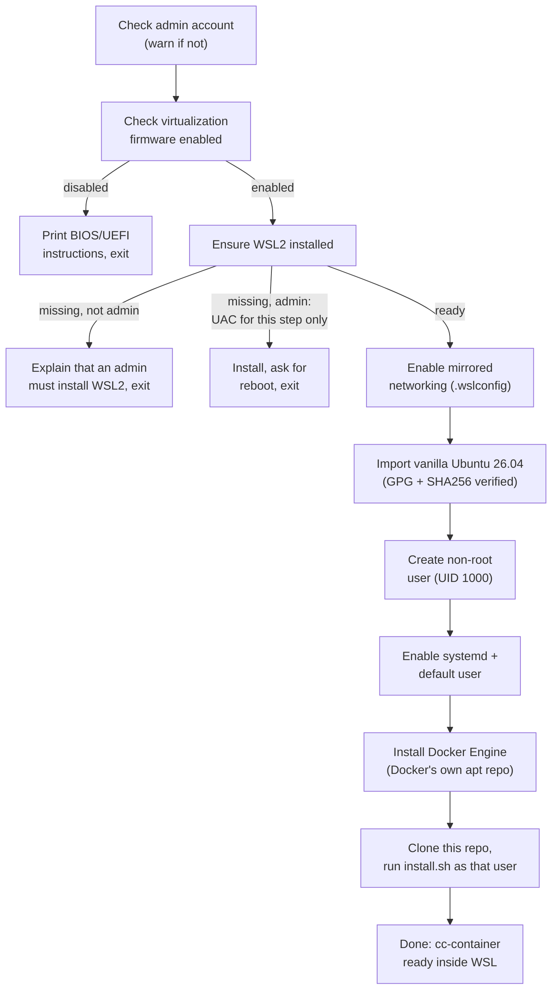

# Windows onboarding (experimental)

**Status: implemented, not yet verified end-to-end on real Windows hardware**
(see "Known limitations" below) — the Linux/macOS setup this repo has always
targeted is unaffected either way; this is a purely additive, opt-in entry
point.

Everything else in this repo assumes a working Docker/Compose host already —
`install.sh` explicitly checks for `docker` and `docker compose` and exits
with an error otherwise (see [README's Setup section](../README.md#setup)).
`windows/main.go` exists to get a stock Windows machine, with nothing
Docker-related installed yet, to that same starting point with one
double-click.

## Why not `dockerc`

The original idea for this was to ship the installer as a single executable
built with [dockerc](https://github.com/NilsIrl/dockerc) ("compile Docker
images to standalone executables"). Checked and rejected for two reasons,
not just style preference:

- `dockerc` cannot produce a Windows executable at all today — its own
  README lists "MacOS and Windows support (using QEMU)" as an **unchecked**
  roadmap item. It only compiles `x86_64-linux-musl`/`aarch64-linux-musl`
  ELF binaries, which won't run natively on Windows regardless of file
  extension.
- Even set aside Windows support, `dockerc` packages a *single* container
  image into a standalone binary. This repo's entire security model depends
  on `claude-code` and `egress-proxy` being *separate* containers in
  separate network namespaces (see `docker-compose.yml`'s `internal: true`
  network) — a single packaged container can't reproduce that isolation, so
  `dockerc` isn't a fit for this repo's architecture even on Linux.

Hence a real, native Windows `.exe` (Go, cross-compiled, no `dockerc`) that
orchestrates the setup via `wsl.exe`/PowerShell calls and then delegates to
this repo's existing, unmodified `install.sh` inside WSL.

## What it does



Every stage checks whether it's already done before acting (see each stage's
own `*Ready`/`*Exists`/`*Installed` check in `windows/main.go`) — re-running
the same `.exe`, e.g. after the reboot WSL2 enablement usually needs the
first time, just continues instead of starting over.

- **Administrator rights**: the tool runs **unelevated**. At the start it
  checks whether the account is in the local Administrators group (SID
  `S-1-5-32-544` in `whoami /groups`, listed even under UAC's filtered
  token). If not, it prints a warning and carries on — every stage after
  the WSL2 installation should work without admin rights (still to be
  confirmed on real hardware). Only `wsl --install` needs elevation: for an
  admin account, just that one step runs as an elevated copy of the `.exe`
  in its own window via UAC, and the original window waits for it. For a
  non-admin account with WSL2 not yet installed, the tool stops and
  explains that an administrator has to run it (or `wsl --install
  --no-distribution`) once.

- **Virtualization check**: `Get-CimInstance Win32_Processor`'s
  `VirtualizationFirmwareEnabled` property. This can't be turned on from
  Windows — BIOS/UEFI settings are firmware-level by design. If it's off, the
  tool prints instructions and stops; it does not attempt anything further.
- **WSL2**: `wsl --install --no-distribution` (the modern one-shot command;
  enables the required Windows features and installs the WSL2 kernel without
  the curated Microsoft Store default distro, since the next stage imports
  its own).
- **Mirrored networking**: writes `networkingMode=mirrored` into the
  per-user `%USERPROFILE%\.wslconfig` (`[wsl2]` section), merging with
  whatever is already there rather than overwriting it. Needs Windows 11
  23H2 or newer — older builds silently ignore the setting. This only
  affects how WSL2 itself reaches the network; it has no effect on (and
  needs no changes to) this repo's own `internal`/`external` Docker networks
  inside the distro.
- **Ubuntu 26.04 import**: `wsl --import`s Canonical's official `.wsl`
  image as a distro named `ClaudeCodeSandbox` — a vanilla import, not the
  customized Microsoft Store app. Before importing, two checks, either of
  which aborts on failure:
  1. `SHA256SUMS.gpg` must be a valid OpenPGP signature over `SHA256SUMS`
     by the pinned **Ubuntu CD Image Automatic Signing Key (2012)**
     (`843938DF228D22F7B3742BC0D94AA3F0EFE21092`). A hash alone would only
     prove the image matches whatever server it came from. The key is
     embedded in the `.exe` (`windows/keys/`, exported from the
     `ubuntu-keyring` package), verified with a small stdlib-only
     implementation (`windows/openpgp.go`) — no `gpg.exe` needed on Windows.
  2. The image's SHA256 must match its entry in that signed `SHA256SUMS`.

  **Where the image comes from:** if a folder named `wsl-image` sits next
  to the `.exe` (or `-image-dir` points somewhere), it's used offline and
  must contain exactly one `*.wsl` image, one `SHA256SUMS*` file (a suffix
  like `SHA256SUMS_ubuntu-26.04` is fine), and that file's `.gpg`
  signature (`SHA256SUMS_ubuntu-26.04.gpg`). The image file name must stay
  as Canonical published it, since that's what `SHA256SUMS` lists.
  Otherwise all three are downloaded from `releases.ubuntu.com/26.04/`,
  picking the latest point release's `*-wsl-amd64.wsl` listed in the
  signed `SHA256SUMS` — so 26.04.2 is picked up without a code change.
- **Non-root user**: an imported rootfs logs in as root by default, which
  would leave `install.sh`, `cc-container`, and every workspace owned by
  root — and the `claude-code` container (UID 1000) unable to write to its
  own `/workspace`. The tool creates a UID-1000 account named after the
  Windows `%USERNAME%` (lowercased, reduced to `[a-z0-9_-]`, fallback
  `claude`), or reuses an existing UID-1000 account if the image ships one.
- **systemd + default user**: `/etc/wsl.conf` with `[boot] systemd=true` and
  `[user] default=<that user>`, then — only if the file actually changed —
  a targeted `wsl --terminate ClaudeCodeSandbox` (not `--shutdown`, which
  would also kill any other WSL distro the user already has running) so it
  restarts with both active — systemd is needed for `dockerd` to run as a
  normal service.
- **Docker Engine**: installed from `download.docker.com`'s own apt
  repository (GPG key + apt source added by the script itself), not
  Ubuntu's outdated `docker.io` package and not a curl-pipe-to-shell
  convenience script. The non-root user is added to the `docker` group
  (on every run, so an interrupted run still ends up correct).
- **Repo + `install.sh`**: clones this repo into that user's home and runs
  its existing `install.sh` unchanged, as that user — no Windows-specific
  fork of that script.

Long-running stages (WSL install, apt, git clone, `install.sh`) stream their
output live. The console window stays open at the end (and on any error)
until Enter is pressed, since the UAC relaunch runs in its own window.

### Flags

| Flag | Purpose |
|------|---------|
| `-image-dir <folder>` | Local image folder (see above) instead of the default `wsl-image` next to the `.exe`. |
| `-rootfs-url <url>` | Exact image to download when there's no local folder, instead of the latest one in `releases.ubuntu.com/26.04/`. `SHA256SUMS` and `SHA256SUMS.gpg` are fetched from the same directory and checked the same way. |
| `-uninstall` | Removes the `ClaudeCodeSandbox` distro — **including everything inside it** (cloned repos, workspaces, Docker images), hence a typed `YES` confirmation — and its folder under `%LOCALAPPDATA%`, and reverts the `.wslconfig` change (see below). Leaves WSL2 itself installed. No admin rights needed. |

Run it from a terminal to pass flags, e.g.
`.\claudecode-sandbox-setup.exe -image-dir D:\ubuntu`.

**`.wslconfig` changes are reversible and don't kill other distros.** The
tool writes a comment line `# added by claudecode-sandbox-setup,
previously: …` above its `networkingMode=mirrored`, recording the earlier
value; `-uninstall` uses it to restore exactly that and leaves a
`networkingMode` the user set themselves untouched. A `.wslconfig` change
only takes effect after the whole WSL VM restarts: the tool runs `wsl
--shutdown` only if no distro is running, and otherwise prints a warning
asking the user to do it when convenient (WSL keeps using NAT until then,
which works too).

## Building

```bash
cd windows
./build.sh   # needs Go on the host; produces claudecode-sandbox-setup.exe
```

Not part of the `claude-code` image build — this is host-side, developer/
release tooling only, same category as `bin/generate-bump-ca.sh`.

`cd windows && go vet ./... && go test ./...` runs the unit tests for the
platform-independent helpers (`.wslconfig` merging, username derivation,
`SHA256SUMS` parsing, local image folder lookup) and the OpenPGP check
against Canonical's real, unmodified 26.04 `SHA256SUMS`/`SHA256SUMS.gpg`
(`windows/testdata/`), including tampered-data and corrupted-signature
rejection; `tests/unit/test_windows_installer.sh` wraps the same
plus a Windows cross-compile, and soft-skips without Go.

## Open items

Tracked here so they don't get lost between sessions; tick off with a date.
The hardware test itself has its own checklist further down.

### 1. Build and tests (blocked in the sandbox: no Go, `go.dev`/`proxy.golang.org` not allowlisted)

- [ ] On a host with Go: `cd windows && gofmt -l . && go vet ./... && go
      test ./... && ./build.sh` (or `./tests/run-tests.sh`, whose
      `test_windows_installer.sh` stops skipping once `go` is on `PATH`).
      **The Go code has never been compiled** — only hand-reviewed; the
      OpenPGP logic was cross-checked in Python against the real files in
      `windows/testdata/` (2026-09-25).
- [ ] Fix whatever that turns up, then the "not yet compiled" note in
      "Known limitations" can go.

### 2. Hardware test

- [ ] Work through the [Hardware test checklist](#hardware-test-checklist).
      The default image URL in particular hasn't been reachable from the
      sandbox — only its file name is confirmed via the signed `SHA256SUMS`.

### 3. Administrator rights — implemented 2026-09-25, not yet compiled

- [x] Check for admin rights first, warn on a non-admin account (see
      "Administrator rights" under "What it does").
- [x] Elevate only for `wsl --install`; everything else runs unelevated.
- [ ] Confirm on real hardware that everything after the WSL2 installation
      really works without admin rights (see checklist).

### 4. Docs after the hardware test

- [ ] Record dated results in this doc.
- [ ] Drop the "not yet verified" status at the top of this doc and in
      README.md's Windows paragraph under "Setup".

### 5. Improvements — implemented 2026-09-25, not yet compiled

- [x] Pick the image name dynamically from the signed `SHA256SUMS`
      (`latestWSLImage` in `windows/main.go`).
- [x] No global `wsl --shutdown` while other distros are running
      (`restartWSLForConfig`).
- [x] Uninstall path: `-uninstall` (`runUninstall`).

## Known limitations

- **Not yet run on real Windows hardware — and not yet compiled.** Written
  and reviewed against the documented behavior of `wsl.exe`,
  `Get-CimInstance`, and `.wslconfig`, but never built (see "Open items"),
  and an actual double-click run — including the
  BIOS-disabled path and the reboot-and-resume path — still needs to happen
  on a real machine before this is trustworthy for anyone else.
- **The default download is pinned to the 26.04 release directory**
  (`defaultReleaseDir` in `windows/main.go`). Point releases are picked up
  automatically; moving to the next LTS needs a code change (or
  `-rootfs-url`).
- **Only one pinned signing key.** If Canonical ever rotates the CD Image
  key, the signature check fails closed until `windows/keys/` and
  `trustedFingerprints` in `windows/openpgp.go` are updated.
- **The OpenPGP check only supports RSA** (v4 keys, binary document
  signatures, SHA-256/384/512) — enough for Canonical's key, not for e.g.
  GnuPG's own EdDSA release signatures, should those ever be needed.
- **Mirrored networking may not be active right after the first run** if
  other distros were running at the time — see the `.wslconfig` note under
  "Flags"; the tool warns about it rather than stopping them.
- **Small TOCTOU window for a local image**: the file is hashed, then
  passed to `wsl --import` by path. Low risk, since it's the user's own
  local file, but the import doesn't re-check it.
- **First-run friction is real**, not hidden: enabling WSL2 for the first
  time commonly needs one reboot. The tool is designed to be safely re-run
  rather than pretending this away, but it is still a two-step experience
  the first time on a machine with nothing pre-configured.
- **Mirrored networking needs Windows 11 23H2+.** On older Windows, the
  `.wslconfig` setting is silently ignored by WSL (not an error this tool
  can detect) — WSL2 keeps using NAT networking instead.
- **`-uninstall` leaves WSL2 installed** and doesn't touch Docker Desktop or
  other distros; turning WSL2 off entirely needs admin rights and is up to
  the user.

## Hardware test checklist

To be worked through once on real hardware (or a Windows 11 VM with nested
virtualization), with each result dated back into this doc before the
"not yet verified" status above and in README.md is dropped:

- [ ] Virtualization **disabled** in firmware: BIOS/UEFI instructions
      appear, window stays open until Enter, nothing else is changed.
- [ ] **Non-admin account**, WSL2 missing: warning at the start, then a
      clear "an administrator must install WSL2" stop — no UAC prompt.
- [ ] **Non-admin account**, WSL2 already installed: warning, then the rest
      completes without any UAC prompt.
- [ ] **Admin account**, WSL2 missing: UAC appears only for the WSL2
      installation (separate window), the original window continues and
      asks for the reboot.
- [ ] Fresh machine without WSL: WSL2 installs, the reboot prompt appears;
      after the reboot, running the `.exe` again picks up where it left off.
- [ ] With a `wsl-image` folder next to the `.exe`: "signature is valid"
      and "SHA256 … matches" appear, nothing is downloaded.
- [ ] Without it: the latest image in `releases.ubuntu.com/26.04/` is
      picked, downloads, and passes both checks.
- [ ] Running it a second time right after success: every stage reports
      done, no redownload, no `wsl --terminate`.
- [ ] An existing `%USERPROFILE%\.wslconfig` with other keys keeps them.
- [ ] `wsl -d ClaudeCodeSandbox` logs in as the non-root user (`id -u` →
      `1000`), `docker run --rm hello-world` works without sudo,
      `cc-container` is on `PATH` in a new shell.
- [ ] `cc-container` in a project directory: the session starts, a file
      created inside the container is writable/owned correctly on the WSL
      side, and `curl -sI https://example.com` inside the container is
      blocked by the allowlist.
- [ ] Windows 10 or Windows 11 before 23H2: mirrored networking is silently
      ignored, but the flow still completes over NAT.
- [ ] Windows username with spaces/umlauts: derived Linux username is sane.
- [ ] With another distro running during the first run: warning about the
      pending WSL restart, the other distro keeps running.
- [ ] `-uninstall`: anything but `YES` aborts; `YES` removes the distro and
      its folder, and `.wslconfig` is back to its previous state.
