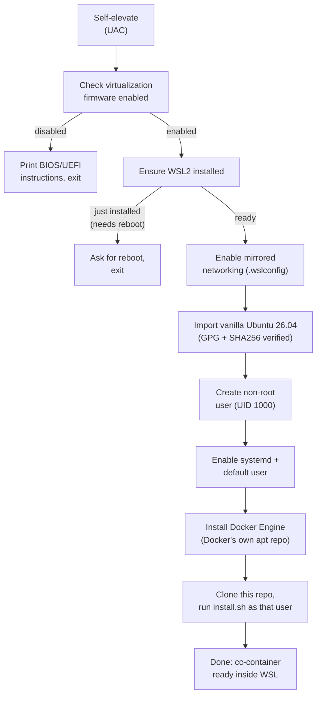

# Windows onboarding (experimental)

**Status: implemented, not yet verified end-to-end on real Windows hardware**
(see "Known limitations" below) — the Linux/macOS setup this repo has always
targeted is unaffected either way; this is a purely additive, opt-in entry
point.

Everything else in this repo assumes a working Docker/Compose host already —
`install.sh` explicitly checks for `docker` and `docker compose` and exits
with an error otherwise (see [README's Setup section](../README.md#setup)).
`windows/main.go` exists to get a stock Windows machine, with nothing
Docker-related installed yet, to that same starting point with one
double-click.

## Why not `dockerc`

The original idea for this was to ship the installer as a single executable
built with [dockerc](https://github.com/NilsIrl/dockerc) ("compile Docker
images to standalone executables"). Checked and rejected for two reasons,
not just style preference:

- `dockerc` cannot produce a Windows executable at all today — its own
  README lists "MacOS and Windows support (using QEMU)" as an **unchecked**
  roadmap item. It only compiles `x86_64-linux-musl`/`aarch64-linux-musl`
  ELF binaries, which won't run natively on Windows regardless of file
  extension.
- Even set aside Windows support, `dockerc` packages a *single* container
  image into a standalone binary. This repo's entire security model depends
  on `claude-code` and `egress-proxy` being *separate* containers in
  separate network namespaces (see `docker-compose.yml`'s `internal: true`
  network) — a single packaged container can't reproduce that isolation, so
  `dockerc` isn't a fit for this repo's architecture even on Linux.

Hence a real, native Windows `.exe` (Go, cross-compiled, no `dockerc`) that
orchestrates the setup via `wsl.exe`/PowerShell calls and then delegates to
this repo's existing, unmodified `install.sh` inside WSL.

## What it does



Every stage checks whether it's already done before acting (see each stage's
own `*Ready`/`*Exists`/`*Installed` check in `windows/main.go`) — re-running
the same `.exe`, e.g. after the reboot WSL2 enablement usually needs the
first time, just continues instead of starting over.

- **Virtualization check**: `Get-CimInstance Win32_Processor`'s
  `VirtualizationFirmwareEnabled` property. This can't be turned on from
  Windows — BIOS/UEFI settings are firmware-level by design. If it's off, the
  tool prints instructions and stops; it does not attempt anything further.
- **WSL2**: `wsl --install --no-distribution` (the modern one-shot command;
  enables the required Windows features and installs the WSL2 kernel without
  the curated Microsoft Store default distro, since the next stage imports
  its own).
- **Mirrored networking**: writes `networkingMode=mirrored` into the
  per-user `%USERPROFILE%\.wslconfig` (`[wsl2]` section), merging with
  whatever is already there rather than overwriting it. Needs Windows 11
  23H2 or newer — older builds silently ignore the setting. This only
  affects how WSL2 itself reaches the network; it has no effect on (and
  needs no changes to) this repo's own `internal`/`external` Docker networks
  inside the distro.
- **Ubuntu 26.04 import**: `wsl --import`s Canonical's official `.wsl`
  image as a distro named `ClaudeCodeSandbox` — a vanilla import, not the
  customized Microsoft Store app. Before importing, two checks, either of
  which aborts on failure:
  1. `SHA256SUMS.gpg` must be a valid OpenPGP signature over `SHA256SUMS`
     by the pinned **Ubuntu CD Image Automatic Signing Key (2012)**
     (`843938DF228D22F7B3742BC0D94AA3F0EFE21092`). A hash alone would only
     prove the image matches whatever server it came from. The key is
     embedded in the `.exe` (`windows/keys/`, exported from the
     `ubuntu-keyring` package), verified with a small stdlib-only
     implementation (`windows/openpgp.go`) — no `gpg.exe` needed on Windows.
  2. The image's SHA256 must match its entry in that signed `SHA256SUMS`.

  **Where the image comes from:** if a folder named `wsl-image` sits next
  to the `.exe` (or `-image-dir` points somewhere), it's used offline and
  must contain exactly one `*.wsl` image, one `SHA256SUMS*` file (a suffix
  like `SHA256SUMS_ubuntu-26.04` is fine), and that file's `.gpg`
  signature (`SHA256SUMS_ubuntu-26.04.gpg`). The image file name must stay
  as Canonical published it, since that's what `SHA256SUMS` lists.
  Otherwise all three are downloaded from `releases.ubuntu.com`.
- **Non-root user**: an imported rootfs logs in as root by default, which
  would leave `install.sh`, `cc-container`, and every workspace owned by
  root — and the `claude-code` container (UID 1000) unable to write to its
  own `/workspace`. The tool creates a UID-1000 account named after the
  Windows `%USERNAME%` (lowercased, reduced to `[a-z0-9_-]`, fallback
  `claude`), or reuses an existing UID-1000 account if the image ships one.
- **systemd + default user**: `/etc/wsl.conf` with `[boot] systemd=true` and
  `[user] default=<that user>`, then — only if the file actually changed —
  a targeted `wsl --terminate ClaudeCodeSandbox` (not `--shutdown`, which
  would also kill any other WSL distro the user already has running) so it
  restarts with both active — systemd is needed for `dockerd` to run as a
  normal service.
- **Docker Engine**: installed from `download.docker.com`'s own apt
  repository (GPG key + apt source added by the script itself), not
  Ubuntu's outdated `docker.io` package and not a curl-pipe-to-shell
  convenience script. The non-root user is added to the `docker` group
  (on every run, so an interrupted run still ends up correct).
- **Repo + `install.sh`**: clones this repo into that user's home and runs
  its existing `install.sh` unchanged, as that user — no Windows-specific
  fork of that script.

Long-running stages (WSL install, apt, git clone, `install.sh`) stream their
output live. The console window stays open at the end (and on any error)
until Enter is pressed, since the UAC relaunch runs in its own window.

### Flags

| Flag | Purpose |
|------|---------|
| `-image-dir <folder>` | Local image folder (see above) instead of the default `wsl-image` next to the `.exe`. |
| `-rootfs-url <url>` | Image to download when there's no local folder, instead of the built-in default (see "Known limitations"). `SHA256SUMS` and `SHA256SUMS.gpg` are fetched from the same directory and checked the same way. |

Flags are forwarded to the elevated copy after the UAC prompt. Run it from a
terminal, e.g. `.\claudecode-sandbox-setup.exe -image-dir D:\ubuntu`.

## Building

```bash
cd windows
./build.sh   # needs Go on the host; produces claudecode-sandbox-setup.exe
```

Not part of the `claude-code` image build — this is host-side, developer/
release tooling only, same category as `bin/generate-bump-ca.sh`.

`cd windows && go vet ./... && go test ./...` runs the unit tests for the
platform-independent helpers (`.wslconfig` merging, username derivation,
`SHA256SUMS` parsing, local image folder lookup) and the OpenPGP check
against Canonical's real, unmodified 26.04 `SHA256SUMS`/`SHA256SUMS.gpg`
(`windows/testdata/`), including tampered-data and corrupted-signature
rejection; `tests/unit/test_windows_installer.sh` wraps the same
plus a Windows cross-compile, and soft-skips without Go.

## Known limitations

- **Not yet run on real Windows hardware.** Written and reviewed against the
  documented behavior of `wsl.exe`, `Get-CimInstance`, and `.wslconfig`, and
  the source cross-compiles, but an actual double-click run — including the
  BIOS-disabled path and the reboot-and-resume path — still needs to happen
  on a real machine before this is trustworthy for anyone else.
- **The default image URL names a point release**
  (`defaultRootfsURL` in `windows/main.go`,
  `releases.ubuntu.com/26.04/ubuntu-26.04.1-wsl-amd64.wsl`, confirmed
  2026-09-25 against Canonical's signed `SHA256SUMS`). It goes stale once
  26.04.2 replaces it in that directory; `-rootfs-url` or a local
  `wsl-image` folder work around that without a rebuild.
- **Only one pinned signing key.** If Canonical ever rotates the CD Image
  key, the signature check fails closed until `windows/keys/` and
  `trustedFingerprints` in `windows/openpgp.go` are updated.
- **First-run friction is real**, not hidden: enabling WSL2 for the first
  time commonly needs one reboot. The tool is designed to be safely re-run
  rather than pretending this away, but it is still a two-step experience
  the first time on a machine with nothing pre-configured.
- **Mirrored networking needs Windows 11 23H2+.** On older Windows, the
  `.wslconfig` setting is silently ignored by WSL (not an error this tool
  can detect) — WSL2 keeps using NAT networking instead.
- **No uninstall/rollback path yet** — mirrors `uninstall.sh`'s scope on the
  Linux side, which also only reverses the `cc-container` PATH symlink, not
  a full teardown. A `wsl --unregister ClaudeCodeSandbox` removes the distro
  manually in the meantime.

## Hardware test checklist

To be worked through once on real hardware (or a Windows 11 VM with nested
virtualization), with each result dated back into this doc before the
"not yet verified" status above and in README.md is dropped:

- [ ] Virtualization **disabled** in firmware: BIOS/UEFI instructions
      appear, window stays open until Enter, nothing else is changed.
- [ ] Fresh machine without WSL: WSL2 installs, the reboot prompt appears;
      after the reboot, running the `.exe` again picks up where it left off.
- [ ] With a `wsl-image` folder next to the `.exe`: "signature is valid"
      and "SHA256 … matches" appear, nothing is downloaded.
- [ ] Without it: the default URL downloads and passes both checks
      (otherwise: record the correct URL here, update `defaultRootfsURL`).
- [ ] Running it a second time right after success: every stage reports
      done, no redownload, no `wsl --terminate`.
- [ ] An existing `%USERPROFILE%\.wslconfig` with other keys keeps them.
- [ ] `wsl -d ClaudeCodeSandbox` logs in as the non-root user (`id -u` →
      `1000`), `docker run --rm hello-world` works without sudo,
      `cc-container` is on `PATH` in a new shell.
- [ ] `cc-container` in a project directory: the session starts, a file
      created inside the container is writable/owned correctly on the WSL
      side, and `curl -sI https://example.com` inside the container is
      blocked by the allowlist.
- [ ] Windows 10 or Windows 11 before 23H2: mirrored networking is silently
      ignored, but the flow still completes over NAT.
- [ ] Windows username with spaces/umlauts: derived Linux username is sane.
