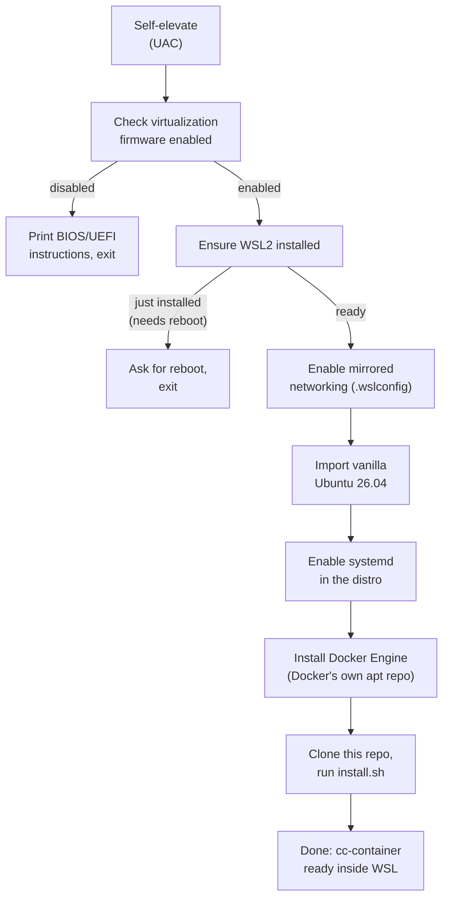

# Windows onboarding (experimental)

**Status: implemented, not yet verified end-to-end on real Windows hardware**
(see "Known limitations" below) — the Linux/macOS setup this repo has always
targeted is unaffected either way; this is a purely additive, opt-in entry
point.

Everything else in this repo assumes a working Docker/Compose host already —
`install.sh` explicitly checks for `docker` and `docker compose` and exits
with an error otherwise (see [README's Setup section](../README.md#setup)).
`windows/main.go` exists to get a stock Windows machine, with nothing
Docker-related installed yet, to that same starting point with one
double-click.

## Why not `dockerc`

The original idea for this was to ship the installer as a single executable
built with [dockerc](https://github.com/NilsIrl/dockerc) ("compile Docker
images to standalone executables"). Checked and rejected for two reasons,
not just style preference:

- `dockerc` cannot produce a Windows executable at all today — its own
  README lists "MacOS and Windows support (using QEMU)" as an **unchecked**
  roadmap item. It only compiles `x86_64-linux-musl`/`aarch64-linux-musl`
  ELF binaries, which won't run natively on Windows regardless of file
  extension.
- Even set aside Windows support, `dockerc` packages a *single* container
  image into a standalone binary. This repo's entire security model depends
  on `claude-code` and `egress-proxy` being *separate* containers in
  separate network namespaces (see `docker-compose.yml`'s `internal: true`
  network) — a single packaged container can't reproduce that isolation, so
  `dockerc` isn't a fit for this repo's architecture even on Linux.

Hence a real, native Windows `.exe` (Go, cross-compiled, no `dockerc`) that
orchestrates the setup via `wsl.exe`/PowerShell calls and then delegates to
this repo's existing, unmodified `install.sh` inside WSL.

## What it does



Every stage checks whether it's already done before acting (see each stage's
own `*Ready`/`*Exists`/`*Installed` check in `windows/main.go`) — re-running
the same `.exe`, e.g. after the reboot WSL2 enablement usually needs the
first time, just continues instead of starting over.

- **Virtualization check**: `Get-CimInstance Win32_Processor`'s
  `VirtualizationFirmwareEnabled` property. This can't be turned on from
  Windows — BIOS/UEFI settings are firmware-level by design. If it's off, the
  tool prints instructions and stops; it does not attempt anything further.
- **WSL2**: `wsl --install --no-distribution` (the modern one-shot command;
  enables the required Windows features and installs the WSL2 kernel without
  the curated Microsoft Store default distro, since the next stage imports
  its own).
- **Mirrored networking**: writes `networkingMode=mirrored` into the
  per-user `%USERPROFILE%\.wslconfig` (`[wsl2]` section), merging with
  whatever is already there rather than overwriting it. Needs Windows 11
  23H2 or newer — older builds silently ignore the setting. This only
  affects how WSL2 itself reaches the network; it has no effect on (and
  needs no changes to) this repo's own `internal`/`external` Docker networks
  inside the distro.
- **Ubuntu 26.04 import**: downloads Canonical's official WSL rootfs
  tarball and `wsl --import`s it as a distro named `ClaudeCodeSandbox` — a
  vanilla import, not the customized Microsoft Store app.
- **systemd**: `/etc/wsl.conf` with `systemd=true`, then a targeted
  `wsl --terminate ClaudeCodeSandbox` (not `--shutdown`, which would also
  kill any other WSL distro the user already has running) so it restarts
  with systemd active — needed for `dockerd` to run as a normal service.
- **Docker Engine**: installed from `download.docker.com`'s own apt
  repository (GPG key + apt source added by the script itself), not
  Ubuntu's outdated `docker.io` package and not a curl-pipe-to-shell
  convenience script.
- **Repo + `install.sh`**: clones this repo into the distro and runs its
  existing `install.sh` unchanged — no Windows-specific fork of that script.

## Building

```bash
cd windows
./build.sh   # needs Go on the host; produces claudecode-sandbox-setup.exe
```

Not part of the `claude-code` image build — this is host-side, developer/
release tooling only, same category as `bin/generate-bump-ca.sh`.

## Known limitations

- **Not yet run on real Windows hardware.** Written and reviewed against the
  documented behavior of `wsl.exe`, `Get-CimInstance`, and `.wslconfig`, and
  the source cross-compiles, but an actual double-click run — including the
  BIOS-disabled path and the reboot-and-resume path — still needs to happen
  on a real machine before this is trustworthy for anyone else.
- **The Ubuntu 26.04 WSL rootfs URL** in `windows/main.go`
  (`ubuntuRootfsURL`) is Canonical's documented naming *pattern* for other
  releases, applied to 26.04 — confirm it against what Canonical has
  actually published before relying on it; it's kept as a single constant
  for exactly this reason.
- **First-run friction is real**, not hidden: enabling WSL2 for the first
  time commonly needs one reboot. The tool is designed to be safely re-run
  rather than pretending this away, but it is still a two-step experience
  the first time on a machine with nothing pre-configured.
- **Mirrored networking needs Windows 11 23H2+.** On older Windows, the
  `.wslconfig` setting is silently ignored by WSL (not an error this tool
  can detect) — WSL2 keeps using NAT networking instead.
- **No uninstall/rollback path yet** — mirrors `uninstall.sh`'s scope on the
  Linux side, which also only reverses the `cc-container` PATH symlink, not
  a full teardown. A `wsl --unregister ClaudeCodeSandbox` removes the distro
  manually in the meantime.
